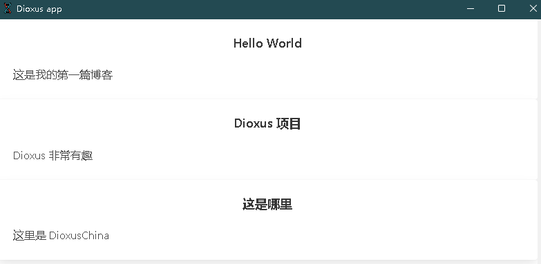

有时候我们需要将同一组件渲染多次，那我们就需要把它当作列表来渲染。

## 遍历渲染

我们模拟一个 **博客** 系统的结构，我们需要根据当前的文章数量渲染出相应的博客 `Post` 组件。

```rsx
rsx! {
    div {
        Post {/* some properties */}
        Post {/* some properties */}
        Post {/* some properties */}
    }
}
```

假设我们的博客数据存放在一个 `Vec` 之中：

```rust
// 为了方便，我使用了元组存放（标题，内容）
let blogs = vec![
    ("Hello World", "这是我的第一篇博客"),
    ("Dioxus 项目", "Dioxus 非常有趣"),
    ("这是哪里", "这里是 DioxusChina"),
]
```
接下来我们通过迭代器将整个 Vec 的内容渲染到 Element 中。
```rust
let ele = blogs.iter().map(|(title, content)| {
    rsx! {
        Post {
            title: title,
            content: content,
        }
    }
});

rsx!(
    div {
        ele
    }
)
```

:::info
这里补充一下：`Post` 是我们封装的组件，组件就是一个接受 `Scope` 返回 `Element` 的函数：
```rust
fn Post(cx: Scope<PostProps>) -> Element {
    cx.render(rsx! {
        div {
            class: "post-content",
            h1 { "{cx.props.title}" },
            p { "{cx.props.content}" }
        }
    })
}
```
:::

:::info
列表渲染完整代码在这里:
```rust
use dioxus::prelude::*;
fn main() {
    dioxus::desktop::launch(App);
}

#[derive(Props, PartialEq)]
struct PostProps {
    title: &'static str,
    content: &'static str,
}
fn Post(cx: Scope<PostProps>) -> Element {
    cx.render(rsx!(
        style {
            [ ".title { font-size: 18px; text-align: center;}",
                ".content{width:100%;}"]
        }
        div {
            class: "card-content",
            h1 {class:"title","{cx.props.title}" },
            p {class:"content","{cx.props.content}" }
        }
    ))
}

fn App(cx: Scope) -> Element {
    let blogs = vec![
        ("Hello World", "这是我的第一篇博客"),
        ("Dioxus 项目", "Dioxus 非常有趣"),
        ("这是哪里", "这里是 DioxusChina"),
    ];
    let ele = blogs.iter().map(|(title, content)| {
        rsx! {
            div{
                class: "card",
                Post {
                    title:title,
                    content: content,
                }
            }
        }
    });
    cx.render(rsx! {
        link {
            rel: "stylesheet",
            href: "https://cdn.jsdelivr.net/npm/bulma@0.9.3/css/bulma.min.css"
        }
        div {
            class: "container",
            ele
        }
    })
}
```


:::

## 过滤迭代器

Rust 的迭代器非常强大，特别是用于过滤数据时。在构建用户界面时，你可能希望过滤部分的项目列表。

```rust
let names = ["jim", "bob", "jane", "doe"];

let ele = names
    .iter()
    .filter(|name| name.starts_with('j'))
    .map(|name| rsx!( li { "{name}" }));
// 过滤以 j 开头的项。
```

## 列表键

在很多情况下我们需要对需要对列表 **增删改查**，所以要对每一项提供一个 `Key` 让它可被识别。

```rust
rsx!( li { key: "a" } )
```

设置一个便于识别的键可帮助 Dioxus 更好的分辨它，并提供相应的反馈。
