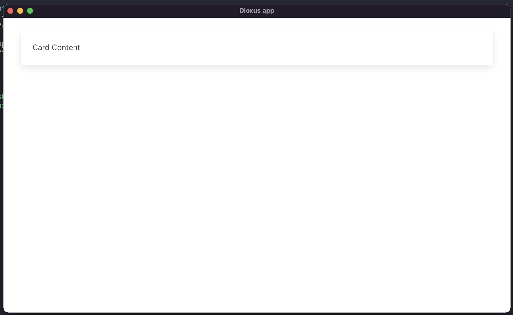

在上一章中我们介绍了 RSX 的基本使用方法，这一章我们来聊聊为页面引入样式。

```rust
fn App(cx: Scope) -> Element {
    cx.render(rsx! {
        style {
            ".app {{ width:100%; background-color:red; }}"
        }
        div {
            class: "app",
            "Hello World"
        }
    })
}
```

我们依然可以在 RSX 中引用 CSS 代码，包括引入一些 CSS UI 框架。

注意：使用上面方式时，记得将.app 后面的{{放在一块，确保中间无空格，要不然会解析失败

### 引入网络 CSS

```rsx
cx.render(rsx! {
    link {
        rel: "stylesheet",
        href: "https://cdn.jsdelivr.net/npm/bulma@0.9.3/css/bulma.min.css"
    }
    br {}
    div {
        class: "container",
        div {
            class: "card",
            div {
                class: "card-content",
                "Card Content"
            }
        }
    }
})
```

我们可以很轻易的使用 UI 框架的样式：




### 引入静态 CSS

如果您不希望通过网络引入 CSS 资源，也可以直接将资源文件打包到二进制应用中。

```rust
cx.render(rsx! {
    style { include_str!("./assets/app.css") }
})
```

通过这种方法可以将某个 CSS 文件引入到应用中。

:::caution
这种导入方法会在编译期将 `./assets/app.css` 的内容直接硬编码到 style 元素中。
:::

### JavaScript 引入

如果你希望引入任何 `JavaScript` 代码，可以用上方相同的方法，
但是我们不建议在程序中使用过多的 JS 代码，因为大部分工作都可以在 Dioxus 之中完成。
过多使用 JavaScript 会导致应用程序代码混乱，毫无意义。

:::info
通过 Javascript 能更轻松的完成应用程序交互，但不要过度使用。
:::